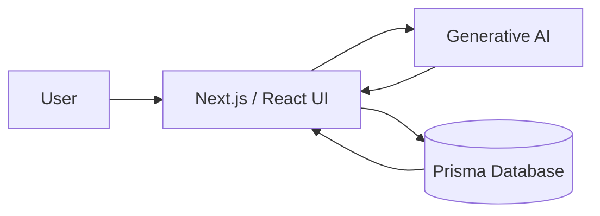

# 🤖 AI Gym Trainer

A fitness-oriented **AI web application** built with Next.js, React, TypeScript, Tailwind CSS, generative AI, and Prisma.

## 🖼️ Application Architecture



## ✨ Overview

The project explores how generative AI can be integrated into a modern web application to create an interactive fitness-focused experience. The frontend provides the user interface while server-side logic connects AI functionality and persistent data.

## 🧰 Tech Stack


## 🚀 Getting Started

```bash
npm install
```

Create a local `.env` file containing the database and AI configuration required by the application, then run:

```bash
npm run dev
```

Open `http://localhost:3000`.

## 📜 Scripts

```bash
npm run dev
npm run build
npm run start
npm run lint
```

## 🎯 What This Project Demonstrates

- AI integration in a full-stack TypeScript application
- Modern React / Next.js application structure
- Database access with Prisma
- Responsive UI development with Tailwind CSS
- Environment-based configuration for external services

## 📌 Status

Active learning / development project.

## 👨‍💻 Author

**Dreamjain** — [GitHub](https://github.com/Dreamjain)
